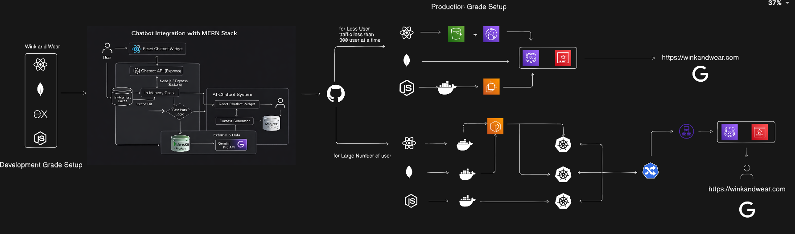
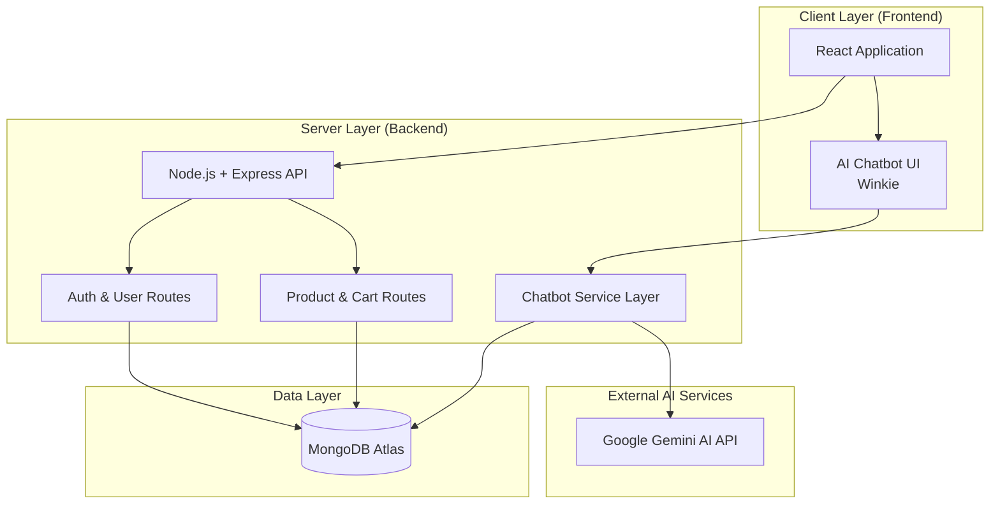

# Wink & Wear | Premium E-Commerce Platform

**Live Website:** https://winkandwear.com/
---

<p align="center">
  
  
  
  
  
  
  
  
  
  
  
  
  
  
  
</p>

---

<p align="center">
  
  
  
  
</p>

---
## 📖 Overview

Wink & Wear is a high-performance, full-stack e-commerce application built on the robust **MERN stack** (MongoDB, Express, React, Node.js). It features a premium, matte-dark UI/UX designed to captivate users and provide an elegant shopping journey. At the core of the platform is an integration with **Google Gemini AI** to deliver an intelligent, personalized shopping experience through our custom AI assistant, "Winkie".

Whether you're looking for the latest fashion trends or exploring exclusive collections, Wink & Wear offers a seamless, intuitive, and highly responsive environment tailored for the modern digital consumer.

---
<p align="center">
  
</p>
---

## ✨ Key Features

- **Intelligent AI Chatbot (Winkie):** Integrated with Google Gemini 1.0 Pro to assist customers in real-time, offering product recommendations and answering queries.
- **Premium User Interface:** A meticulously crafted matte-dark theme providing a sleek, modern aesthetic and reducing eye strain.
- **Secure Authentication:** Robust user registration and login flows protected by SHA-256 Hashing and JWT Session Management.
- **Comprehensive Product Catalog:** A dynamic inventory system allowing users to browse, filter, and discover products effortlessly.
- **Seamless Cart Management:** Synchronized shopping cart state ensuring users never lose their selected items, even across sessions.
- **Responsive Design:** Fully optimized for desktop, tablet, and mobile devices to ensure a flawless experience anywhere.

---

## 🏗️ System Architecture

The platform is designed with a scalable, modular architecture, facilitating a seamless transition from a local development environment to a robust, production-grade cloud ecosystem.


```mermaid
flowchart TD
    %% ================= CLIENT LAYER =================
    subgraph CL["Client Layer (Frontend)"]
        UI[React Application]
        CHAT[AI Chatbot UI<br/>Winkie]
        UI --> CHAT
    end

    %% ================= SERVER LAYER =================
    subgraph SL["Server Layer (Backend)"]
        API[Node.js + Express API]
        AUTH[Auth & User Routes]
        PROD[Product & Cart Routes]
        BOT[Chatbot Service Layer]
        
        API --> AUTH
        API --> PROD
        CHAT --> BOT
    end

    %% ================= EXTERNAL SERVICES =================
    subgraph ES["External AI Services"]
        GEMINI[Google Gemini AI API]
    end

    %% ================= DATA LAYER =================
    subgraph DL["Data Layer"]
        DB[(MongoDB Atlas)]
    end

    %% ================= CONNECTIONS =================
    UI --> API
    BOT --> GEMINI
    AUTH --> DB
    PROD --> DB
    BOT --> DB

```

### Infrastructure Strategy
- **Development**: Hosted via Render/Vercel with MongoDB Atlas for scalable database management.
- **Production (Planned)**: Containerized deployment utilizing **Docker** and **Kubernetes**, hosted on **AWS (EC2, S3, CloudFront)** for global low-latency delivery and high availability.

---

## 🤖 AI Shopping Assistant (Winkie)

"Winkie" is not just a standard chatbot; it leverages the power of **Google Gemini 1.0 Pro** to assist customers dynamically and intelligently in real-time.

- **Hybrid Logic**: Uses a custom "Fast Path" for common policy queries (e.g., returns, support, shipping) to ensure instant responses, and falls back to Gemini for complex natural language understanding and contextual reasoning.
- **Context-Aware**: Dynamically queries the MongoDB database to provide real-time, accurate product recommendations, pricing, and availability based on the user's explicit intent.
- **Optimized UX**: Implements streaming responses for an interactive, real-time consultation experience, mimicking a natural human conversation.

---

## 💻 Tech Stack

### Frontend
- **Framework:** React.js
- **Routing:** React Router DOM
- **State Management:** Context API
- **Styling:** Vanilla CSS (Premium Matte Design philosophy)

### Backend
- **Runtime:** Node.js
- **Framework:** Express.js
- **Authentication:** JWT (JSON Web Tokens), OAuth 2.0 (Planned)
- **API Architecture:** RESTful APIs

### Database
- **Database:** MongoDB
- **ODM:** Mongoose

### AI & Machine Learning
- **Core AI Engine:** Google Generative AI (Gemini 1.0 Pro)

### Security
- **Data Protection:** SHA-256 Hashing for sensitive data
- **Session Control:** JWT Session Management

---

## 🔌 API Reference (Core)

Below is an overview of the primary endpoints used in the platform. The API follows REST principles and uses JSON for data exchange.

| Endpoint | Method | Description | Auth Required |
| :--- | :--- | :--- | :--- |
| `/signup` | POST | User registration & secure JWT generation | No |
| `/login` | POST | User authentication and session initiation | No |
| `/allproducts` | GET | Retrieve full product inventory and details | No |
| `/addtocart` | POST | Synchronize shopping cart state and add items | Yes |
| `/chat` | POST | Interact with the AI Assistant (Winkie) | No |

*Note: Additional endpoints exist for user profile management, order processing, and admin controls.*

---

## 📂 Project Structure

```text
winkwear/
├── Admin/                 # Admin Dashboard (if applicable)
├── BackEnd/               # Node.js/Express server and API logic
│   ├── src/
│   │   ├── controllers/   # Request handling logic
│   │   ├── models/        # Mongoose database schemas
│   │   ├── routes/        # API endpoint definitions
│   │   └── services/      # Business logic and AI integration
│   └── .env               # Backend environment variables
├── FrontEnd/              # React frontend application
│   ├── src/
│   │   ├── Components/    # Reusable UI components
│   │   ├── Pages/         # Page-level components
│   │   └── Context/       # Global state management
│   └── .env               # Frontend environment variables
└── README.md              # Project documentation
```

---

## 🚀 Setup & Installation

Follow these steps to set up the project locally for development and testing.

### Prerequisites
Before you begin, ensure you have the following installed:
- Node.js (v16.0.0 or higher)
- npm or yarn package manager
- MongoDB Atlas account (or a Local MongoDB instance running)
- Google Gemini API Key

### Quick Start

1. **Clone the Repository**:
   ```bash
   git clone https://github.com/PriyanshuSingh10114/winkwear.git
   cd winkwear
   ```

2. **Install Dependencies**:
   Install both frontend and backend dependencies using the recursive flag, or navigate to each folder.
   ```bash
   npm install --recursive
   ```
   *(Alternatively, run `npm install` inside both `FrontEnd` and `BackEnd` directories.)*

3. **Environment Configuration**: 
   You will need to set up environment variables for both the backend and frontend.

   **Backend (`BackEnd/.env`):**
   Create a `.env` file in the `BackEnd/` directory and add:
   ```env
   PORT=4000
   MONGO_URI=your_mongodb_connection_string
   GOOGLE_GEMINI_API=your_gemini_api_key
   JWT_SECRET=your_jwt_secret_key
   ```

   **Frontend (`FrontEnd/.env`):**
   Create a `.env` file in the `FrontEnd/` directory and add any necessary frontend variables (e.g., API base URL):
   ```env
   REACT_APP_API_URL=http://localhost:4000
   ```

4. **Run the Services**:
   Open two terminal windows or tabs to run the frontend and backend concurrently.

   - **Start the Backend Server**:
     ```bash
     npm start --prefix BackEnd
     ```
   - **Start the Frontend Application**:
     ```bash
     npm run dev --prefix FrontEnd
     ```

5. **Access the Application**:
   Open your browser and navigate to `http://localhost:5173` (or the port specified by your frontend bundler) to view the app!

---

## 👥 Development Team

- **Priyanshu Singh**  
  *Cloud Architect & Lead Developer*  
  GitHub: https://github.com/PriyanshuSingh10114

- **Priyansh Singh**  
  *AI Integration & System Optimization*  
  GitHub: https://github.com/priyanshsingh11

---

> [!NOTE]
> This project is currently in active development, transitioning towards a production-grade Kubernetes-managed architecture. Expect continuous updates and improvements to the infrastructure and feature set.
