# Wink & Wear | Premium E-Commerce Platform

**Live Demo:** [https://winkandwear-1.onrender.com/](https://winkandwear-1.onrender.com/)  
**GitHub Repository:** [https://github.com/PriyanshuSingh10114/winkwear](https://github.com/PriyanshuSingh10114/winkwear)

---

## 📖 Table of Contents
1. [Project Overview](#-project-overview)
2. [Infrastructure & System Design](#-infrastructure--system-design)
3. [AI Chatbot: Winkie](#-ai-chatbot-winkie)
4. [Data Architecture (Models)](#-data-architecture-models)
5. [API Reference](#-api-reference)
6. [Security & Authentication](#-security--authentication)
7. [Frontend Architecture](#-frontend-architecture)
8. [Setup & Installation](#-setup--installation)
9. [Project Roadmap](#-project-roadmap)
10. [Team](#-team)

---

## � Project Overview

**Wink & Wear** is a full-stack e-commerce application designed for a premium shopping experience. It utilizes the **MERN** stack (MongoDB, Express, React, Node.js) and integrates **Google Gemini AI** to provide a dynamic, intelligent user interface. The platform features inclusive collection management, a robust admin panel, and high-performance asset delivery.

### Core Value Props
- **Aesthetic Excellence:** Precision-crafted matte dark UI with HSL color tokens.
- **Intelligent Discovery:** AI-driven product recommendations and support.
- **Scalable Backend:** JWT-secured RESTful API designed for high availability.

---

## 🏗 Infrastructure & System Design

The architecture is engineered to scale from a lean development setup to a high-availability, production-grade ecosystem capable of serving thousands of concurrent users.


### 1. Development Grade Setup (Low Traffic Architecture)
*Designed for early-stage deployment and testing with a capacity of <300 concurrent users.*

- **Source Control & CI/CD**: Seamless integration with **GitHub** for automated deployments and version tracking.
- **Frontend Delivery**:
    - **Amazon S3**: Hosting optimized static assets (React build).
    - **Amazon CloudFront**: Global Content Delivery Network (CDN) to minimize latency by caching assets at edge locations.
- **Data Layer**: A dedicated **MongoDB** instance (Atlas) providing high-performance document-based storage.
- **Backend Services**: Node.js/Express API running on **Amazon EC2** compute instances, serving core business logic.
- **DNS & Perimeter Security**: 
    - **Amazon Route 53**: Handling high-availability DNS routing.
    - **SSL/TLS Certificates**: Ensuring end-to-end encryption via AWS Certificate Manager (ACM).

### 2. Production Grade Setup (Enterprise Scalability)
*Built for high-traffic scenarios using modern orchestration and containerization strategies.*

- **Containerization (Docker)**: Every component (Frontend, Backend, and Database adapters) is containerized using **Docker** for environment parity and rapid deployment.
- **Elastic Orchestration (Kubernetes)**:
    - **Auto-Healing & Scaling**: Deployment on **Kubernetes (K8s)** clusters to manage container lifecycles, ensuring zero downtime.
    - **Multi-Node Clusters**: Horizontal scaling across multiple worker nodes to handle "Large Number of user" traffic spikes.
- **Image Management**: Container images are versioned and stored in a secure registry (e.g., **Amazon ECR**).
- **Advanced Traffic Management**:
    - **Global Load Balancer**: Distributes incoming requests across the Kubernetes service mesh effectively.
    - **AWS WAF & Shield**: Enterprise-grade protection against DDoS attacks and common web exploits (represented by the red shield icon).
- **Edge Performance**: Unified delivery via **Route 53** and **CloudFront**, ensuring that users worldwide experience blazing-fast load times.

---

## 🤖 AI Chatbot: Winkie

"Winkie" is not just a chatbot; it's an integrated service that bridges the gap between static content and user intent.

### Technical Implementation
- **LLM Engine:** Google Gemini 1.0 Pro.
- **Integrated Search:** The service extracts categories (`men`, `women`, `kids`) and price ceilings from natural language and queries the MongoDB `Product` collection in real-time.
- **Streaming:** Implements `generateContentStream` to pipe AI tokens directly to the React frontend, minimizing Time to First Byte (TTFB).
- **Fallback Logic:** A hybrid "Fast Path" handles repetitive queries (e.g., "return policy") without incurring LLM latency or cost.

```mermaid
sequenceDiagram
    participant U as User
    participant F as React Frontend
    participant B as Node.js Backend
    participant G as Gemini AI
    participant D as MongoDB

    U->>F: "Find men's shirts under ₹2000"
    F->>B: POST /api/chatbot (intent extraction)
    B->>D: Find {category: 'men', price: {$lte: 2000}}
    D-->>B: Return [Product List]
    B->>G: Prompt (Products + Context)
    G-->>B: Stream AI Response
    B-->>F: Chunked Data Stream
    F-->>U: Display Rich UI Component
```



---

## 🗄 Data Architecture (Models)

The system uses **Mongoose ODM** to strictly enforce schematic integrity.

### 1. User Model (`Users`)
- `name`: String (Required)
- `email`: String (Unique, Indexed)
- `password`: Hashed String
- `cartData`: Object (Map of `id` to `quantity`)
- `date`: Date (Auto-generated)

### 2. Product Model (`Product`)
- `id`: Number (Primary identifier for cart logic)
- `name`: String
- `images`: String (S3 URL/Local Path)
- `category`: String (Enum: `men`, `women`, `kid`)
- `new_price`: Number
- `old_price`: Number
- `available`: Boolean (Default: true)

### 3. Review Model (`Review`)
- `productId`: Number (Indexed)
- `userId`: String
- `userName`: String
- `rating`: Number (Min: 1, Max: 5)
- `comment`: String

---

## ⚡ API Reference

### Authentication
- `POST /signup`: Create new account. Returns JWT.
- `POST /login`: Verify credentials. Returns JWT.
- `POST /auth/google`: OAuth 2.0 flow using `google-auth-library`.

### Product Management
- `GET /allproducts`: List all inventory.
- `GET /newcollection`: Fetch last 8 added items.
- `GET /popularinwomen`: Fetch top-rated women's items.
- `POST /addproduct` (Admin): Insert new product with Image upload.

### Cart & Orders
- `POST /addtocart`: Increments quantity (Protected by JWT).
- `POST /removefromcart`: Decrements quantity (Protected by JWT).
- `POST /getcart`: Syncs frontend state with DB.

---

## 🔐 Security & Authentication

### JWT Implementation
Wink & Wear uses JSON Web Tokens for session persistence.
1. **Issuer:** Backend signs a payload `{user: {id: user._id}}` with a 256-bit secret key.
2. **Middleware:** The `fetchUser` middleware intercepts requests, extracts the `auth-token` from headers, and verifies it before granting access to protected routes (`/addtocart`, etc.).

### Google OAuth Flow
- Backend validates the `credential` token sent from the Google Login button.
- It uses the Ticket payload to either log in an existing user or auto-provision a new account.

---

## ⚛️ Frontend Architecture

### State Management: Context API
We use a global `ShopContext` to synchronize the cart across the entire SPA.
- **Provider:** Wraps `App.jsx`, providing `all_product`, `cartItems`, and helper functions like `getTotalCartAmount`.
- **Syncing:** Whenever the app mounts, it fetches the cart from `/getcart` if a token is present, ensuring cross-device persistence.

### Routing
Utilizes `react-router-dom` for client-side navigation:
- `/:category`: Dynamic category filtering.
- `/product/:productId`: Nested routes for detailed SKU view.
- `/cart`: Protected view with checkout logic integration.

---

## 🚀 Setup & Installation

### Environment Variables
Create a `.env` in the root and Backend directories:
```env
MONGO_URI=your_mongodb_connection_string
GOOGLE_GEMINI_API=your_gemini_key
GOOGLE_CLIENT_ID=your_google_id
JWT_SECRET=your_secret_key
```

### Installation Steps
1. **Clone & Install:**
   ```bash
   git clone https://github.com/PriyanshuSingh10114/winkwear.git
   npm install --recursive
   ```
2. **Seed Data (Optional):**
   Access Admin Panel to add your initial product catalog.

3. **Execution:**
   - **Backend:** `cd BackEnd && npm start`
   - **Frontend:** `cd FrontEnd && npm run dev`

---

## 🗺 Project Roadmap

- [ ] **Stripe/Razorpay Integration:** Transition from COD placeholder to real-time gateways.
- [ ] **Advanced Analytics:** Dashboard for admin to track sales velocity per category.
- [ ] **Image Optimization:** Move from local storage to **Sharp** optimized S3 uploads.
- [ ] **Dockerization:** Complete Dockerfile setup for all 3 tiers (Front/Back/Admin).
- [ ] **Search Engine:** Move from Mongoose regex to **ElasticSearch** for faster discovery.

---

## 👥 Team

- **Priyanshu Singh (Lead Developer/Visionary):** The architect who built the foundation and identity of Wink & Wear.
- **Priyansh Singh (AI Engineer/Full-Stack):** Leading the AI-powered transformation and system optimization.

---

Stay Bold. Stay You. 💫
