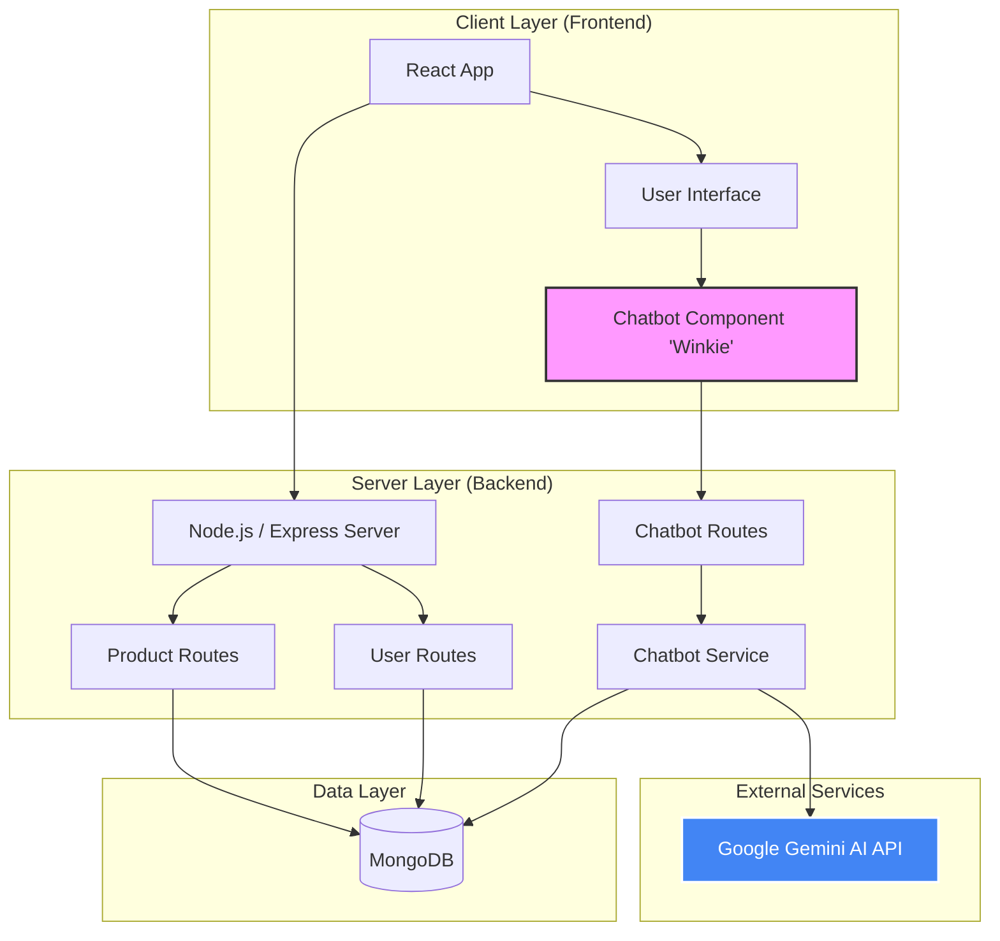

# Wink & Wear | E-Commerce Platform

**Live Demo:** [https://winkandwear-1.onrender.com/](https://winkandwear-1.onrender.com/)  
**GitHub Repository:** [https://github.com/PriyanshuSingh10114/winkwear](https://github.com/PriyanshuSingh10114/winkwear)

---

## Table of Contents
1. [Overview](#overview)
2. [Infrastructure Architecture](#infrastructure-architecture)
3. [AI Chatbot Integration](#ai-chatbot-integration)
4. [Data Models](#data-models)
5. [API Reference](#api-reference)
6. [Security](#security)
7. [Frontend Architecture](#frontend-architecture)
8. [Setup](#setup)
9. [Team](#team)

---

## Overview

Wink & Wear is a full-stack e-commerce application built using the MERN stack (MongoDB, Express, React, Node.js). It integrates Google Gemini AI to provide an intelligent shopping assistant and features a responsive, matte-dark user interface designed for a premium shopping experience.

---

## Infrastructure Architecture

The system is designed to transition from a development environment to a scalable production ecosystem.

### 1. Development Environment
- **CI/CD:** Automated deployment via GitHub.
- **Frontend:** Static assets hosted on Amazon S3 and delivered via CloudFront CDN.
- **Backend:** Node.js/Express API running on Amazon EC2 compute instances.
- **Database:** MongoDB Atlas (Document Store).
- **Networking:** Route 53 for DNS and AWS Certificate Manager for SSL/TLS.

### 2. Production Environment
- **Containerization:** All services containerized using Docker.
- **Orchestration:** Managed by Kubernetes (K8s) for auto-scaling and high availability.
- **Image Registry:** Versioned images stored in Amazon ECR.
- **Security:** AWS WAF and Shield for DDoS protection and web exploit mitigation.

---

## AI Chatbot Integration

The "Winkie" shopping assistant manages user queries by bridging real-time product data with generative AI.

- **Engine:** Google Gemini 1.0 Pro.
- **Functionality:** Extracts categories and budget constraints from natural language to query MongoDB directly.
- **Optimization:** Uses streaming responses (generateContentStream) for low latency and a "Fast Path" for common policy-related queries.

# WinkWear System Design

This document outlines the architecture of WinkWear, including the newly integrated AI Shopping Assistant, **Winkie**.

## High-Level Architecture

The system follows a MERN stack architecture (MongoDB, Express, React, Node.js) with an additional integration for AI-powered features.

## Chatbot Interaction Flow

Winkie is designed to be fast and responsive, using a tiered approach to handle user queries.

1.  **Fast Path**: Common queries (greetings, return policy, contact) are handled instantly via hardcoded logic to save API costs and latency.
2.  **Product Context**: If a user asks about products or pricing, the system queries the MongoDB database for real-time product data.
3.  **AI Generation**: Complex queries are sent to Google Gemini with the relevant system prompt and product context.
4.  **Streaming**: Responses are streamed back to the frontend for a "real-time typing" effect.
5.  **Caching**: Responses are cached for 10 minutes to improve performance for repeated queries.

## Deployment Grade Setups

### Development Grade (Current)
- **Frontend**: Local React Development Server.
- **Backend**: Local Node.js server.
- **Database**: MongoDB Atlas or Local MongoDB.
- **AI**: Google Gemini API (Free Tier).

### Production Grade (Planned)
- **Frontend**: Hosted on S3/CloudFront or Vercel.
- **Backend**: Containerized (Docker) and managed by Kubernetes (EKS/GKE) for scalability.
- **Load Balancing**: AWS ALB or Nginx for distributing traffic.
- **Database**: Managed MongoDB (Atlas Production Tier).
- **Monitoring**: CloudWatch / ELK Stack for logs and performance tracking.

---

> [!TIP]
> **Winkie** also acts as a primary filter for customer support, handling around 80% of common queries before escalating to human email support.

---

## Data Models

Structured using Mongoose for schematic integrity:

- **Users:** Stores profile data, hashed credentials, and persistent cart objects.
- **Product:** Manages metadata including pricing, categorization, and availability.
- **Review:** Handles product ratings and user feedback with reverse-chronological sorting.

---

## API Reference

### Authentication
- `POST /signup`: Account creation (Returns JWT).
- `POST /login`: Credential verification (Returns JWT).
- `POST /auth/google`: OAuth 2.0 flow via Google Auth Library.

### Core Operations
- `GET /allproducts`: Complete inventory retrieval.
- `POST /addtocart`: Increment item quantity (Requires Auth).
- `POST /getcart`: Synchronize frontend state with database (Requires Auth).

---

## Security

- **Authentication:** JSON Web Tokens (JWT) are used for session persistence. Protected routes use the `fetchUser` middleware for header-based token verification.
- **Google OAuth:** Validates ID tokens on the backend to facilitate secure social login.

---

## Frontend Architecture

- **State Management:** React Context API (ShopContext) provides global access to products and shopping cart data.
- **Routing:** React Router DOM manages SPA navigation and dynamic category filtering.

---

## Setup

### Prerequisites
- Node.js (v16+)
- MongoDB Atlas account
- Google Gemini API Key

### Installation
1. Clone the repository.
2. Install dependencies: `npm install --recursive`
3. Configure `.env` files with `MONGO_URI`, `GOOGLE_GEMINI_API`, and `GOOGLE_CLIENT_ID`.
4. Start services:
   - Backend: `cd BackEnd && npm start`
   - Frontend: `cd FrontEnd && npm run dev`

---

## Team

- **Priyanshu Singh:** Lead Developer and Architect.
- **Priyansh Singh:** AI Integration and System Optimization.
