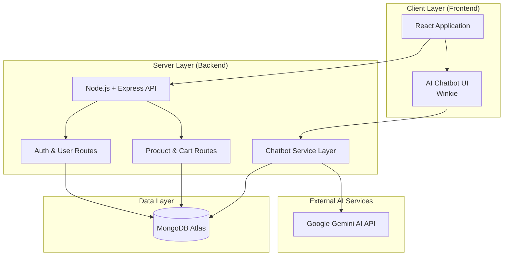

# Wink & Wear | Premium E-Commerce Platform

**Live Website:** https://winkandwear.com/
---

##  Overview

Wink & Wear is a high-performance, full-stack e-commerce application built on the **MERN stack** (MongoDB, Express, React, Node.js). It features a premium, matte-dark UI/UX and integrates **Google Gemini AI** to deliver an intelligent shopping experience through a custom AI assistant, "Winkie".

---

##  System Architecture

The platform is designed with a modular architecture, facilitating a seamless transition from a local development environment to a scalable, production-grade cloud ecosystem.



### Infrastructure Strategy
- **Development**: Hosted via Render/Vercel with MongoDB Atlas.
- **Production (Planned)**: Containerized deployment using **Docker** and **Kubernetes**, hosted on **AWS (EC2, S3, CloudFront)** for global low-latency delivery.

---

##  AI Shopping Assistant (Winkie)

"Winkie" leverages **Google Gemini 1.0 Pro** to assist customers in real-time.

- **Hybrid Logic**: Uses a "Fast Path" for common policy queries (returns, support) and Gemini for complex natural language understanding.
- **Context-Aware**: Dynamically queries the MongoDB database to provide real-time product recommendations and pricing based on user intent.
- **Optimized UX**: Implements streaming responses for an interactive, real-time consultation experience.

---

## Tech Stack

- **Frontend**: React.js, React Router, Context API, Vanilla CSS (Premium Matte Design).
- **Backend**: Node.js, Express.js, JWT Authentication, OAuth 2.0.
- **Database**: MongoDB with Mongoose ODM.
- **AI/ML**: Google Generative AI (Gemini).
- **Security**: SHA-256 Hashing, JWT Session Management.

---

## API Reference (Core)

| Endpoint | Method | Description | Auth Required |
| :--- | :--- | :--- | :--- |
| `/signup` | POST | User registration & JWT generation | No |
| `/login` | POST | User authentication | No |
| `/allproducts` | GET | Retrieve full product inventory | No |
| `/addtocart` | POST | Synchronize shopping cart state | Yes |
| `/chat` | POST | Interact with the AI Assistant | No |

---

## Setup & Installation

### Prerequisites
- Node.js (v16+)
- MongoDB Atlas / Local MongoDB
- Google Gemini API Key

### Quick Start
1. **Clone & Install**:
   ```bash
   git clone https://github.com/PriyanshuSingh10114/winkwear.git
   npm install --recursive
   ```
2. **Environment Configuration**: Create `.env` files in `BackEnd/` and `FrontEnd/` with your credentials:
   - `MONGO_URI`, `GOOGLE_GEMINI_API`, `JWT_SECRET`.
3. **Run Services**:
   - Backend: `npm start --prefix BackEnd`
   - Frontend: `npm run dev --prefix FrontEnd`

---

## Development Team

- **Priyanshu Singh**  
  *Cloud Architect & Lead Developer*  
  GitHub: https://github.com/PriyanshuSingh10114

- **Priyansh Singh**  
  *AI Integration & System Optimization*  
  GitHub: https://github.com/priyanshsingh11

---
> [!NOTE]
> This project is currently in active development, transitioning towards a production-grade Kubernetes-managed architecture.
